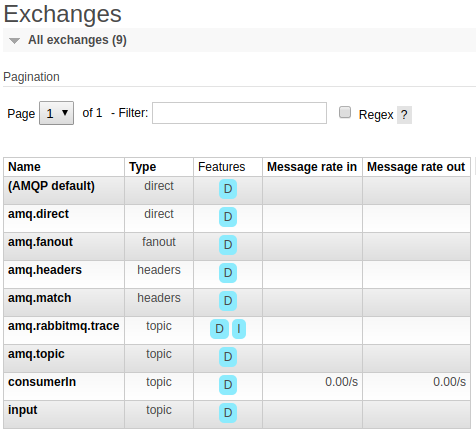
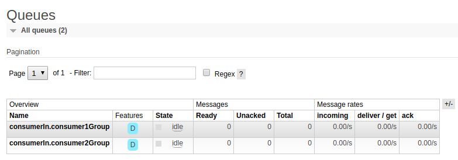
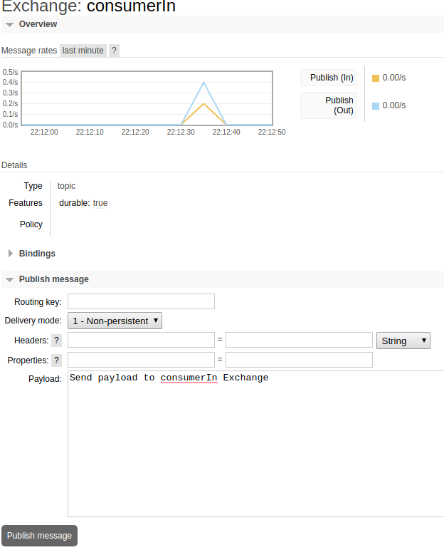
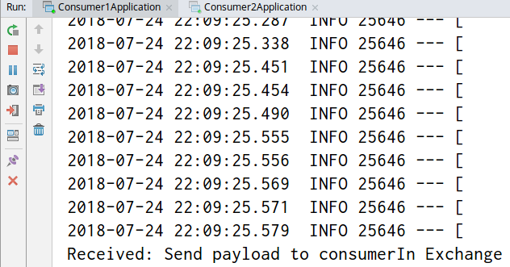

# RabbitMQ test

A simple project to demonstrate how RabbitMQ works with Spring Cloud Stream.

## Project structure

**rabbit-producer** (not yet developed)  
**rabbit-consumer-1** - A service that is subscribed to the `consumerIn` exchange.  
**rabbit-consumer-2** - Also a service that is subscribed to the `consumerIn` exchange.

### Consumer application.properties

```
# default settings in docker-compose
spring.rabbitmq.host=localhost
spring.rabbitmq.port=5672
spring.rabbitmq.username=guest
spring.rabbitmq.password=guest

# The name of the exchange
spring.cloud.stream.bindings.input.destination=consumerIn

# The name for the group of consumers binded to the consumerIn exchange
spring.cloud.stream.bindings.input.group=consumer1Group
```

## Instructions

1. In the root directory, run docker-compose with `docker-compose up --build`. (Might need sudo)
2. Run `Consumer1Application.java` and `Consumer2Application.java`
3. Login to the RabbitMQ console at `http://localhost:15672` using guest/guest.
4. The exchange tab should display the `consumerIn` exchange.

5. The queues tab should display `consumerIn.consumer1Group` and `consumerIn.consumer2Group`.

6. Send a message to the `consumerIn` exchange via the console.

7. Both `Consumer1Application` and `Consumer2Application` should receive the payload.

8. To test the grouping feature, run multiple instances of `Consumer1Application` and `Consumer2Application`. Only one 
instance from the group should receive the payload.

## Questions

- Multiple input destination for a group?
- How do acknowledge modes work with Spring transactions.
- When to use durable subscribers?
- Should this https://github.com/spring-cloud/spring-cloud-stream/issues/1342 the use of invalidate Spring Cloud Stream 
in an autoscaling setup? Apparently, this is not an issue with Kafka and Spring Cloud Stream. Only with RabbitMQ 
and Spring Cloud Stream.